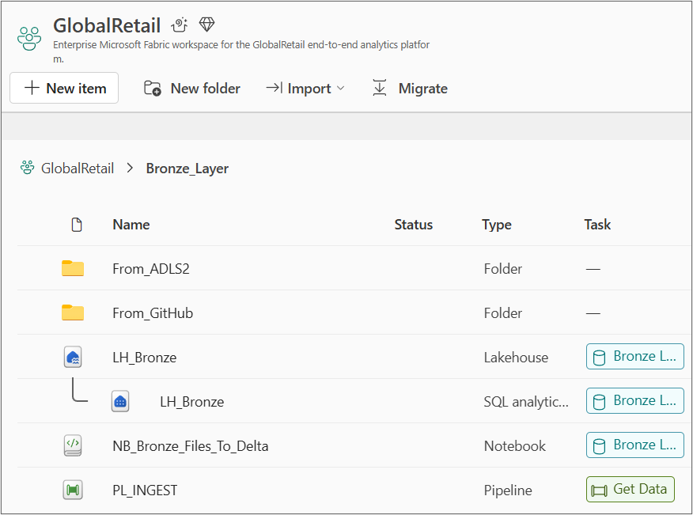
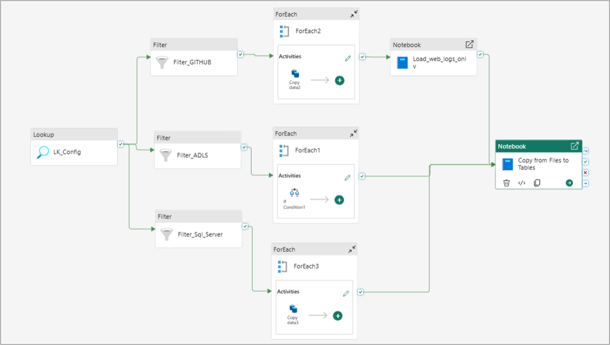
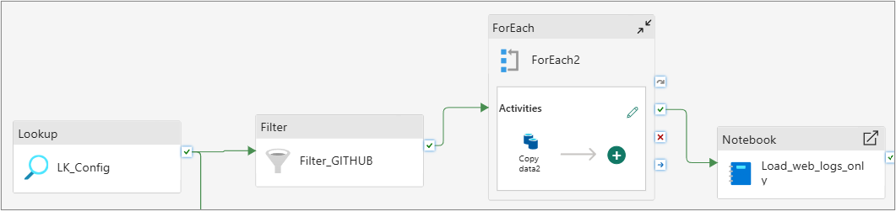
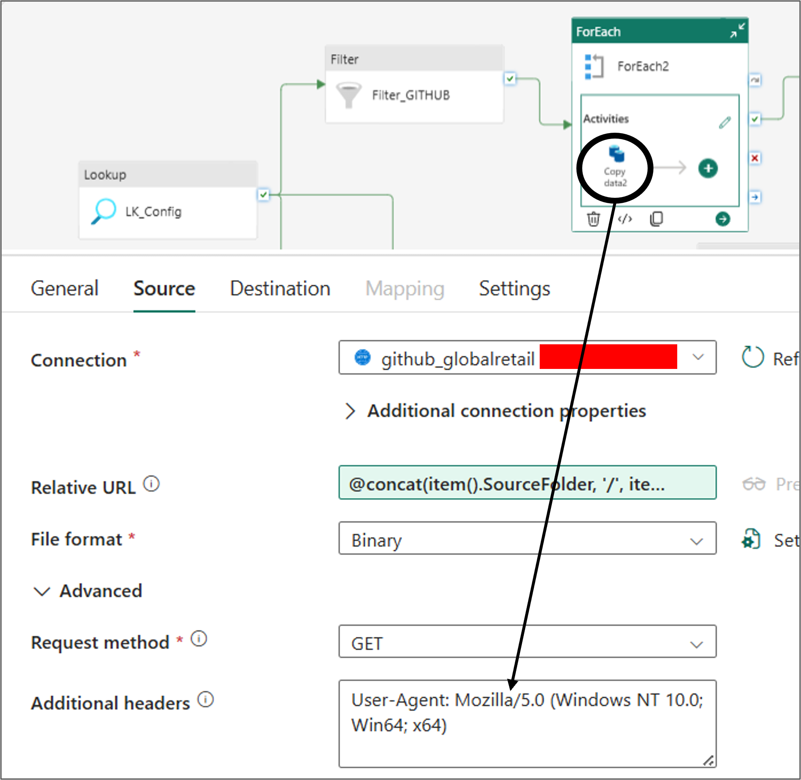
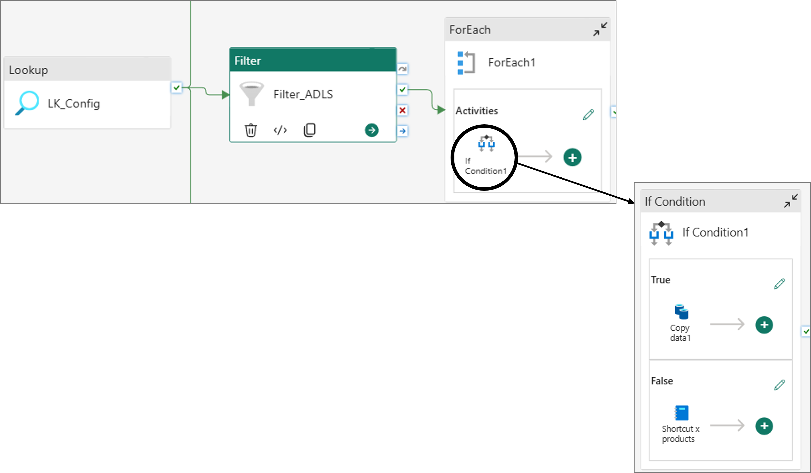
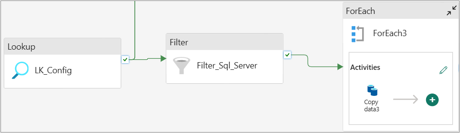
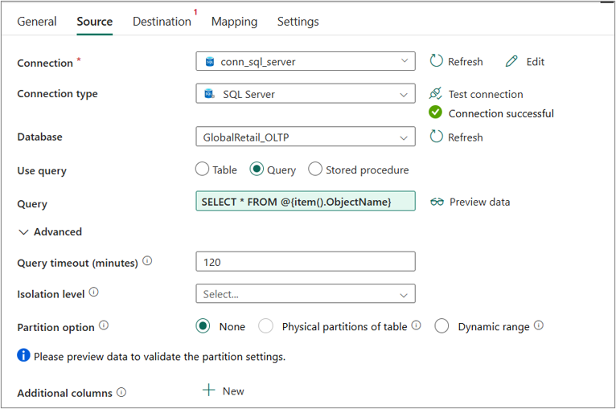
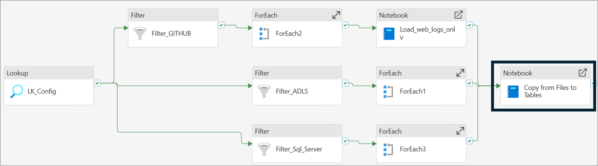
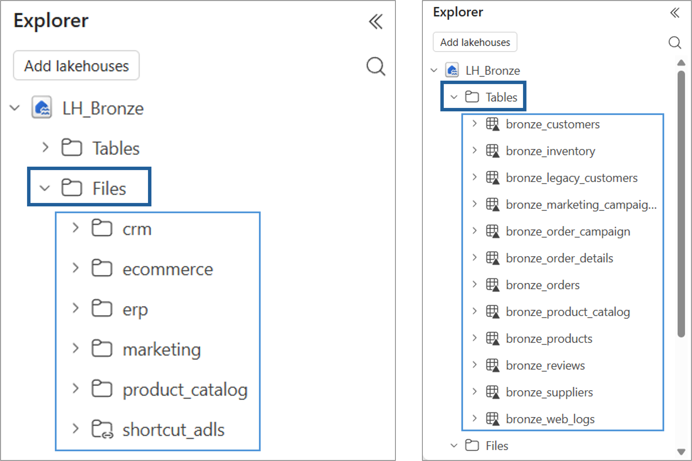

# Bronze Layer

> The Bronze layer is the first landing point for all data inside Microsoft Fabric. It preserves source data with minimal structural transformations required for storage and downstream processing. No business rules, cleansing, deduplication or enrichment are applied in this layer.

---
# Table of Contents
1. [Fabric Objects & Structure](#fabric-objects--structure)

2. [Metadata-Driven Ingestion](#metadata-driven-ingestion)

3. [Pipeline: PL_INGEST](#pipeline-pl_ingest)
    - [Branch 1 — GitHub](#branch-1--github)
      - [Fetching Files](#fetching-files)
      - [Required Header](#required-header)
      - [Copy Activity](#copy-activity)
      - [Notebook for web_logs.json (Large File / Git LFS)](#notebook-for-web_logsjson-large-file--git-lfs)
      - [Note for product_catalog.json](#note-for-product_catalogjson)
      
    - [Branch 2 — ADLS2](#branch-2--adls2)
      - [products.csv— OneLake Shortcut](#productscsv--onelake-shortcut)
        
    - [Branch 3 — SQL Server](#branch-3--sql-server)
      - [Copy Activity](#copy-activity-1)
      
4. [From Files to Delta Tables: NB_Bronze_Files_To_Delta](#from-files-to-delta-tables-nb_bronze_files_to_delta)

5. [Resulting Bronze Tables & Folder Structure in LH_Bronze](#resulting-bronze-tables--folder-structure-in-lh_bronze)

---

# Fabric Objects & Structure



| Object | Type | Purpose |
|---|---|---|
| LH_Bronze | Lakehouse | Stores raw data as Delta tables (Tables/) and raw files (Files/) |
| PL_INGEST | Pipeline | Metadata-driven ingestion from all three sources into Bronze |
| NB_Bronze_Files_To_Delta | Notebook | Converts raw files landed in Files/ into Delta tables in Tables/ |
| NB_Bronze_Shortcut | Notebook | Creates a OneLake Shortcut for products.csv via Fabric REST API |
| NB_load_web_logs | Notebook | Downloads the large web_logs.json file directly from GitHub (Git LFS) |

```text
GlobalRetail
│
└── Bronze Layer
     │
     ├── LH_Bronze
     │    ├── Tables/
     │    ├── Files/
     │    └── SQL Analytics Endpoint
     │
     ├── From_ADLS2
     │    └── NB_Bronze_Shortcut
     │    
     ├── From_Github
     │    └── NB_load_web_logs
     │
     ├── NB_Bronze_Files_To_Delta        
     │
     └── PL_INGEST
```

---

# Metadata-Driven Ingestion

Rather than hardcoding ingestion logic per source and per file, a single **configuration file** (`config_ingestion.csv`) drives the entire pipeline. Each row describes one object to ingest: where it comes from, where it should land, in what format, and how it should be copied.

This is the core design decision of the whole Bronze layer: **adding a new source file never requires touching the pipeline** , it only requires adding a new row to the configuration file. The pipeline logic stays generic and reusable, while the configuration file carries all the source-specific detail.

| SourceType  | SourceFolder     | ObjectName               | DestinationFolder | DestinationTable             | FileFormat | LoadType | CopyMode | Enabled |
|-------------|------------------|--------------------------|-------------------|------------------------------|------------|----------|----------|---------|
| ADLS        | crm              | customers.csv            | crm               | bronze_customers              | csv        | FULL     | COPY     | 1       |
| ADLS        | crm              | legacy_customers.csv     | crm               | bronze_legacy_customers       | csv        | FULL     | COPY     | 1       |
| ADLS        | erp              | suppliers.csv            | erp               | bronze_suppliers              | csv        | FULL     | COPY     | 1       |
| ADLS        | erp              | inventory.csv            | erp               | bronze_inventory              | csv        | FULL     | COPY     | 1       |
| ADLS        | erp              | products.csv             | shortcut_adls     | bronze_products               | csv        | FULL     | SHORTCUT | 1       |
| GITHUB      | product_catalog  | product_catalog.json     | product_catalog   | bronze_product_catalog        | json       | FULL     | COPY     | 1       |
| GITHUB      | marketing        | marketing_campaigns.csv  | marketing         | bronze_marketing_campaigns    | csv        | FULL     | COPY     | 1       |
| GITHUB      | ecommerce        | web_logs.json            | ecommerce         | bronze_web_logs               | json       | FULL     | COPY     | 1       |
| SQL Server  | sales            | sales.Orders             | ecommerce         | bronze_orders                 | parquet    | FULL     | COPY     | 1       |
| SQL Server  | sales            | sales.OrderDetails       | ecommerce         | bronze_order_details          | parquet    | FULL     | COPY     | 1       |
| SQL Server  | sales            | sales.Reviews            | ecommerce         | bronze_reviews                | parquet    | FULL     | COPY     | 1       |
| SQL Server  | sales            | sales.OrderCampaign      | marketing         | bronze_order_campaign         | parquet    | FULL     | COPY     | 1       |

The configuration captures, for every object:
- which source system it comes from (ADLS, GitHub, SQL Server)
- which subfolder/domain it belongs to (crm, erp, marketing, ecommerce, sales)
- its source name and destination name
- its file format (csv, json, parquet)
- whether it should be fully copied or exposed via a shortcut
- whether it is currently enabled, so rows can be turned on/off without being deleted

The configuration file is stored inside the LH_Bronze Lakehouse in the Files folder:
```text
GlobalRetail
│
└── Bronze Layer
     │
     └── LH_Bronze
          │
          └── Files
               └── config_ingestion.csv
```

---

# Pipeline: PL_INGEST

The pipeline reads the configuration file once via a Lookup activity, then branches into three independent flows based on the source type. Each branch is responsible for a different source system and follows a different ingestion pattern, since each source has different constraints (file size, connector type, data structure).

At a high level, the three branches converge at the end into a single notebook that promotes every raw file landed in Bronze `Files/` into proper Delta tables in Bronze `Tables/`.

For the complete JSON code: [PL_INGEST](../../fabric_workspace/01.%20bronze_layer/PL_INGEST.json)



## Branch 1 — GitHub
This branch ingests files stored in GitHub through an HTTP connector, simulating an external API-based data integration. 

A Filter activity selects the GitHub sources from the configuration table, while excluding web_logs.json, which is handled separately due to its large size (~276 MB) and Git LFS storage.

A ForEach loop then iterates over the remaining files product_catalog.json and marketing_campaigns.csv and loads them into the Bronze layer through a standard Copy Activity. Since the source folder contains both CSV and JSON files, the files are transferred using the Binary format, preserving their original structure for subsequent processing.

The web_logs.json file is instead processed by the dedicated NB_load_web_logs notebook, which is triggered through a separate pipeline branch specifically designed to handle the large file.



### Fetching Files

Files are retrieved using the **raw content URL**, not the standard GitHub web interface URL:

Correct (raw content, usable by the HTTP connector):
`https://raw.githubusercontent.com/<user>/<repo>/main/globalretail-source-data/`


Incorrect (GitHub web UI, not a raw file endpoint):
`https://github.com/<user>/<repo>/tree/main/globalretail-source-data`


> The key difference: `raw.githubusercontent.com` replaces `github.com`, and the `tree` segment is removed from the path. Using the web UI URL inside a Copy Activity will fail, since it returns an HTML page rather than the raw file content.

### Required Header

To avoid GitHub blocking or throttling automated requests, a `User-Agent` header must be set on the HTTP connection in the Fabric pipeline:

User-Agent: Mozilla/5.0 (Windows NT 10.0; Win64; x64)




### Copy Activity
A for loop activity reads all the filtered rows from the previous Filter Activity, selecting only GITHUB and excluding `web_logs.json` 

All the files are dynamically copied using the relative url in the source module: `@concat(item().SourceFolder, '/', item().ObjectName)`

Also the destination path is dynamically generated pasting the data into the LH_Bronze with this logic: `@item().DestinationFolder / @item().ObjectName`


### Notebook for `web_logs.json` (Large File / Git LFS)

Unlike the other two files, `web_logs.json` is significantly large (~276 MB) and is tracked via **Git LFS** in the repository. This creates two implications:

1. **Copy Activity is not suitable**: a standard pipeline Copy Activity against the HTTP connector would time out or be highly inefficient for a file of this size.
2. **A dedicated notebook is used instead**: [NB load web logs](../../fabric_workspace/01.%20bronze_layer/NB_load_web_logs.ipynb) downloads the file directly via Python (`urllib.request`) into the Bronze Lakehouse `Files` area, bypassing the pipeline's Copy Activity entirely.


### Note for product_catalog.json
product_catalog.json contains nested structures once loaded into Bronze:

- attributes: a struct field with sub-fields (color, warranty_months, weight_kg)
- images: an array of URL strings

These are not flattened at ingestion time, they remain as-is in Bronze (raw, unmodified) and are only flattened during Silver layer processing, via a dedicated recursive cleaning function.

---

## Branch 2 — ADLS2

This branch handles CRM and ERP batch files stored in ADLS2. A Filter activity selects the enabled records where SourceType = ADLS, and a ForEach loop processes each file according to the CopyMode defined in the configuration table.

For files with CopyMode = COPY, a standard Copy Activity transfers the source file into the corresponding Bronze folder. 

For products.csv, where CopyMode = SHORTCUT, the pipeline instead triggers a dedicated notebook that creates a OneLake Shortcut, exposing the source data in the Bronze layer without physically copying the file.

This configuration-driven approach allows the same pipeline branch to handle both ingestion strategies dynamically, with the processing logic determined by the CopyMode value rather than requiring separate pipeline flows for each source.



### `products.csv` — OneLake Shortcut

Unlike the other ERP files (suppliers.csv and inventory.csv), products.csv **is not physically copied** into the Bronze Lakehouse. Instead, a **OneLake Shortcut** is created, providing a virtual reference to the file stored in ADLS2 at `landing/erp/Shortcut/products.csv`.

The file therefore remains physically stored in ADLS2 while being exposed in the Bronze Lakehouse as:

`LH_Bronze/Files/shortcut_adls/products.csv`

This approach avoids data duplication while allowing the file to be consumed directly within the Fabric environment.

The shortcut is provisioned programmatically through the **Fabric REST API** (`/v1/workspaces/{workspaceId}/items/{lakehouseId}/shortcuts`) rather than manually through the Fabric UI. This demonstrates an automatable and repeatable provisioning pattern that can be integrated into the ingestion process.

The implementation is available here [NB Bronze Shortcut](../../fabric_workspace/01.%20bronze_layer/NB_Bronze_Shortcut.ipynb)

---


## Branch 3 — SQL Server

This branch retrieves transactional data from the on-premises OLTP database, via an on-premises gateway that bridges the local SQL Server instance with Fabric's cloud pipelines. Since this data is already structured and relational, it is written directly into Bronze `Tables/`, skipping the intermediate `Files/` landing step used by the other two sources; there is no benefit in landing already-structured relational data as a raw file first.



### Copy Activity
For SQL Server sources, the Copy Activity uses a different ingestion approach compared to ADLS2 and GitHub. Instead of dynamically resolving a file path, the source is defined through a SQL query that directly retrieves the required tables from the SQL Server database:



The destination is the Bronze Lakehouse Tables area, where each table is dynamically resolved using the configuration value `@item().DestinationTable`

---

# From Files to Delta Tables: NB_Bronze_Files_To_Delta
The 3 branches converge to a single notebook in the pipeline:



Copy Activities land raw files inside the Lakehouse `Files/` area, but a `Files/` folder is not a queryable table, it is just raw file storage. A dedicated notebook is responsible for the final promotion step: reading every raw file described in the configuration, converting it into a proper **Delta table** and writing it into `Tables/`. Of course SQL Server rows are skipped because already loaded in `Tables/`.

Along the way, the notebook also takes care of two structural necessities that have nothing to do with business logic:

- **Column name sanitization**: Delta Lake forbids certain characters in column names (spaces and a handful of symbols). Since raw source files may contain such characters, they are normalized before the table is created, otherwise the write would simply fail.
- **Audit columns**: every table gets two extra columns added at write time — an ingestion timestamp and the originating source file name — so that any record can later be traced back to exactly when and from where it entered the platform.

This notebook is intentionally the **only** place in Bronze where a transformation-like operation happens (renaming columns), and even this is treated as a structural necessity, not a business rule, in fact the data values themselves are never touched.

The full notebook is available here: [NB Bronze Files to Delta](../../fabric_workspace/01.%20bronze_layer/NB_Bronze_Files_To_Delta.ipynb)

---

# Resulting Bronze Tables & Folder Structure in LH_Bronze



| Table | Source |
|---|---|
| bronze_customers | ADLS2 (CRM) |
| bronze_legacy_customers | ADLS2 (CRM) |
| bronze_suppliers | ADLS2 (ERP) |
| bronze_inventory | ADLS2 (ERP) |
| bronze_products | ADLS2 (ERP, via Shortcut) |
| bronze_product_catalog | GitHub |
| bronze_marketing_campaigns | GitHub |
| bronze_web_logs | GitHub (large file, via notebook) |
| bronze_orders | SQL Server |
| bronze_order_details | SQL Server |
| bronze_reviews | SQL Server |
| bronze_order_campaign | SQL Server |

```text
LH_Bronze
|
├── Tables
|    ├── bronze_customers
|    ├── bronze_inventory
|    ├── bronze_legacy_customers
|    ├── bronze_marketing_campaigns
|    ├── bronze_order_campaign
|    ├── bronze_order_details
|    ├── bronze_orders
|    ├── bronze_product_catalog
|    ├── bronze_products
|    ├── bronze_reviews
|    ├── bronze_suppliers
|    └── bronze_web_logs
|    
└── Files
     ├── config_ingestion.csv
     |
     ├── crm
     |    ├── customers.csv
     |    └── legacy_customers.csv
     |
     ├── ecommerce
     |    └── web_logs.json
     |
     ├── erp
     |    ├── inventory.csv
     |    └── suppliers.csv
     |
     ├── marketing
     |    └── marketing_campaigns.csv
     |
     ├── product_catalog
     |    └── product_catalog.json
     |
     └── shortcut_adls
          └── products.csv
```
