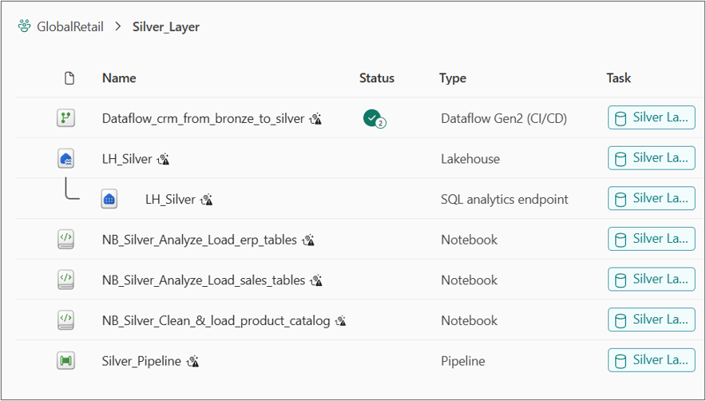
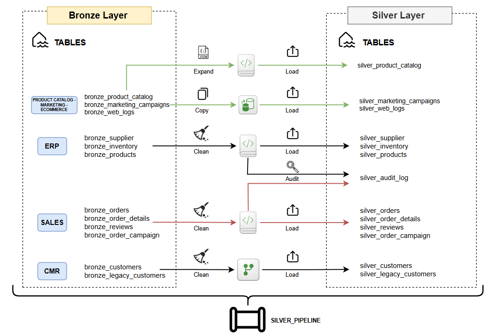
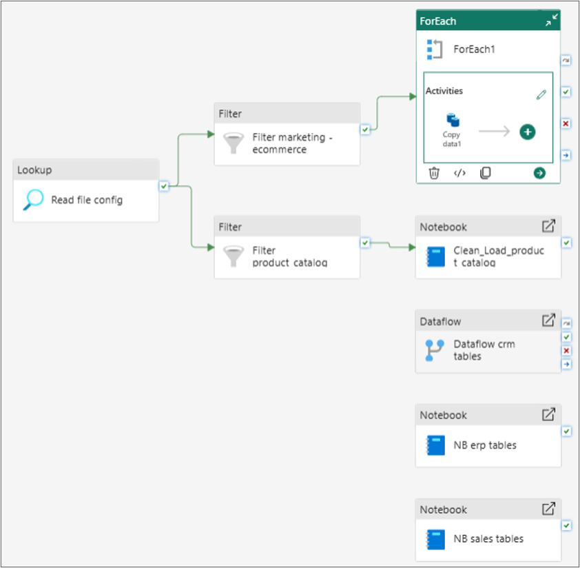

# Silver Layer

> The Silver layer transforms raw Bronze data into clean, deduplicated, standardized, and quality-checked datasets. This is where semi-structured data gets parsed, business-irrelevant noise gets removed and every table becomes reliable to be consumed by the Gold layer modeling logic.

---

# Fabric Objects & Structure


| Object | Type | Purpose |
|---|---|---|
| LH_Silver | Lakehouse | Stores cleaned data as Delta tables |
| NB_Silver_Analyze_Load_ERP_Tables | Notebook | Cleans and loads ERP tables (suppliers, inventory, products) |
| NB_Silver_Analyze_Load_sales_tables | Notebook | Cleans and loads SQL Server-sourced tables (orders, order_details, reviews, order_campaign) |
| NB_Silver_Clean_Load_product_catalog | Notebook | Flattens nested JSON structures (attributes, images) |
| Dataflow_crm_from_bronze_to_silver | Dataflow Gen2 | Cleans CRM tables (customers, legacy_customers) |
| Silver_Pipeline | Pipeline | Orchestrates all Silver transformations across sources |


```text
GlobalRetail
│
└── Silver Layer
     │
     ├── LH_Silver
     │    ├── Tables/
     │    └── SQL Analytics Endpoint
     │
     ├── NB_Silver_Analyze_Load_ERP_Tables 
     │    
     ├── NB_Silver_Analyze_Load_sales_tables
     │
     ├── NB_Silver_Clean_Load_product_catalog
     │
     ├── Dataflow_crm_from_bronze_to_silver     
     │
     └── Silver_Pipeline
```

---

# Architecture



---


# Pipeline: Silver_Pipeline
This pipeline promotes the ingested data from the Bronze layer to the Silver layer, it is designed for scalability and governance rather than one-off processing. 
On one side we have a branch that reads the same configuration file used in the Bronze layer to isolate and manage some specific tables, while on the other side
there are some independent objects used to apply more sophisticated transformations trhough notebooks and dataflows.

In practice it's a configuration-driven orchestrator that dispatches the "silvering" work depending on the folder/domain each table belongs to using different tool to transform and clean data.

For the complete JSON code: Silver_Pipeline (aggiungere link JSON)




## ERP Tables: NB_Silver_Analyze_Load_ERP_Tables

This notebook processes all ERP-sourced Bronze tables (suppliers, inventory, products) and follows a consistent flow: read the same configuration file used in Bronze, filter down to only the ERP-related rows, profile data quality before touching anything, apply lightweight structural cleaning, write the result to Silver, and log the outcome.

### Configuration-Driven, Reused from Bronze

The same `config_ingestion.csv` file used to drive Bronze ingestion is reused here, filtered to the ERP domain only. This keeps a single source of truth for "what objects exist in this project" across both layers, rather than maintaining a separate list for Silver processing.

### Pre-Cleaning Data Quality Check

Before any transformation happens, a data quality report is generated for every ERP table, to establish a baseline of the raw data state. For each table, this report captures:

- the total row count
- the number of duplicate rows (comparing total rows against distinct rows)
- the number of "ghost rows" (rows where every single column is NULL)
- the NULL percentage for every individual column, flagging anything above a 10% threshold as worth reviewing

This step exists specifically to make data quality visible and auditable, rather than silently cleaning data without ever knowing how dirty it was to begin with.

### Lightweight, Non-Destructive Cleaning

The cleaning applied here is deliberately conservative: it fixes structural issues, not business content. Concretely, it trims leading/trailing spaces from text columns, normalizes empty strings to proper NULLs (so downstream tools like Power BI and SQL treat missing data consistently), and drops fully-empty "ghost rows". Two audit columns are also added at this point — a processing timestamp and the source folder — to support lineage tracing later on.

Every ERP table is then written to Silver as a full overwrite, since these are relatively small, slowly-changing reference tables where a full reload is cheap and simple.

### Audit Logging

Every execution of this notebook (and of the sales notebook described below) writes its results — row counts, duration, success/failure status — into a shared `silver_audit_log` Delta table, in append mode. This means the audit log accumulates history across runs rather than being overwritten, giving a full execution history over time rather than just a snapshot of the last run. If any table fails during processing, the notebook still attempts all remaining tables before raising an explicit error at the end, so a single failure does not silently block the rest of the batch.

Example result after execution:

    Processing: bronze_suppliers -> silver_suppliers
      Completed | Bronze rows: 500 | Silver rows: 500 | Discarded: 0

    Processing: bronze_inventory -> silver_inventory
      Completed | Bronze rows: 10,000 | Silver rows: 10,000 | Discarded: 0

    Processing: bronze_products -> silver_products
      Completed | Bronze rows: 10,000 | Silver rows: 10,000 | Discarded: 0

    Tables OK: 3/3 | Tables Failed: 0/3

---

## CRM Tables: Dataflow Gen2

Unlike ERP and SQL Server tables, CRM data is processed using a **Dataflow Gen2** rather than a PySpark notebook. This choice reflects the nature of the data: only two tables, moderate volume, and transformations that map naturally to Power Query's low-code visual editor rather than justifying a full Spark job.

The Dataflow (`Dataflow_crm_from_bronze_to_silver`) connects directly to `LH_Bronze` as its source and writes into `LH_Silver` as its destination.

### bronze_customers

This table arrives already reasonably clean from Bronze, so no transformation is applied — it is loaded into Silver as-is.

### bronze_legacy_customers

This table intentionally simulates a "dirty" legacy system export with inconsistent formatting, and receives more involved cleaning:

- **Deduplication**: exact full-row duplicates are removed
- **Country standardization**: inconsistent country naming (e.g. "USA" vs "United States") is normalized to a single consistent value, targeting only the relevant column so it never accidentally matches unrelated text elsewhere
- **Placeholder normalization**: literal placeholder values such as "UNKNOWN" in the phone field are converted to proper NULLs, so they do not cause errors during later type conversions
- **Locale-aware date parsing**: date columns are parsed using an explicit locale, to avoid ambiguous day/month misinterpretation that can happen with mixed date formats
- **Safe type casting**: postal codes are cast to text rather than numeric, to avoid losing meaningful leading zeros
- **Data quality flagging**: a new boolean column flags whether each record has a valid (non-null) email, useful later for filtering or reporting on data completeness
- **Column reordering**, purely for readability and consistency of the output table

### Loading into Silver

Both queries are configured with a destination pointing to `LH_Silver`, producing `silver_customers` and `silver_legacy_customers`. After running the Dataflow, both tables sit in Silver alongside the ones produced by the ERP notebook.

---

## SQL Server Tables: NB_Silver_Analyze_Load_sales_tables

This notebook processes all SQL Server-sourced Bronze tables (orders, order details, reviews, order campaign attribution). It follows the same overall pattern as the ERP notebook — configuration-driven table selection, cleaning, full overwrite to Silver, shared audit logging — but with a simpler cleaning approach, since this data originates from a relational OLTP database that already enforces its own constraints at the source, and therefore requires less aggressive structural cleanup.

The cleaning here focuses purely on trimming text columns and normalizing empty strings to NULL, followed by removal of fully-empty rows. Unlike the ERP notebook, no separate pre-cleaning quality report is produced here — the assumption is that OLTP-sourced data is inherently more structured than exported flat files, so the emphasis shifts from "diagnose how dirty is this data" to "apply a quick consistency pass and move on".

Example result after execution:

    Processing: bronze_orders -> silver_orders
      Completed | Bronze rows: 100,000 | Silver rows: 100,000 | Discarded: 0

    Processing: bronze_order_details -> silver_order_details
      Completed | Bronze rows: 249,521 | Silver rows: 249,521 | Discarded: 0

    Processing: bronze_reviews -> silver_reviews
      Completed | Bronze rows: 69,636 | Silver rows: 69,636 | Discarded: 0

    Processing: bronze_order_campaign -> silver_order_campaign
      Completed | Bronze rows: 72,034 | Silver rows: 72,034 | Discarded: 0

This notebook writes to the same shared `silver_audit_log` table used by the ERP notebook, so both contribute to a single, unified execution history.

---

## Marketing and E-commerce Tables: Direct Copy in Silver_Pipeline

Two remaining Bronze tables — the marketing campaigns and the web logs — require no cleaning at all, so they are handled directly inside `Silver_Pipeline` using native pipeline activities rather than a notebook. A Lookup activity reads the same configuration file used throughout the project, a Filter isolates these two tables specifically, and a ForEach + Copy Activity loop moves each one straight from Bronze Tables to Silver Tables, overwriting the destination on every run.

This is the simplest possible path in the whole Silver layer: since the data is already clean, there is no reason to route it through a notebook or a Dataflow just to perform a plain copy.

## Product Catalog: Notebook-Based Flattening

The product catalog is the one Silver transformation that exists purely because of structure, not because of data quality. Once loaded into Bronze, it contains two columns that are not "flat": one field holds a nested set of sub-attributes (color, warranty, weight) as a single structured value, and another holds a list of image URLs as an array, with a variable number of entries per product. Neither Power BI nor a standard relational Gold model can meaningfully consume nested or array-typed columns — they need to become ordinary columns and rows.

A dedicated notebook (`NB_Silver_Clean_Load_product_catalog`) handles this in two conceptual steps:

1. **Recursive cleaning**: the same trim/empty-to-NULL logic used elsewhere in Silver is applied here too, but it has to work recursively, reaching inside the nested attribute structure and inside every element of the image list — a plain top-level cleaning pass would not touch anything nested.
2. **Flattening**: the nested attribute structure is expanded into ordinary top-level columns, and the image list is exploded so that each URL becomes its own row, tagged with a position index (so the first/main image can still be distinguished from secondary ones).

One important consequence of this design: because exploding the image list turns one product row into multiple rows (one per image), the resulting `silver_product_catalog` table legitimately has **more rows** than its Bronze counterpart. This is expected behavior, not a data quality problem.

---

## Complete Silver Pipeline

Putting every branch together, `Silver_Pipeline` orchestrates all of the above into a single flow:

    Lookup (read config_ingestion.csv)
    |
    +-- Filter (marketing, ecommerce) --> ForEach --> Copy Activity (direct promotion, no cleaning)
    |
    +-- Filter (product_catalog)      --> Notebook (flatten nested JSON)
    |
    +-- Dataflow Gen2                 --> CRM tables (customers, legacy_customers)
    |
    +-- Notebook                      --> SQL Server tables (orders, order_details, reviews, order_campaign)
    |
    +-- Notebook                      --> ERP tables (suppliers, inventory, products)

Each branch runs independently and uses the transformation engine best suited to its data, converging into a fully populated Silver layer, with a shared audit log capturing the history of every notebook-based execution.

| Table | Source Engine |
|---|---|
| silver_customers | CRM (Dataflow Gen2) |
| silver_legacy_customers | CRM (Dataflow Gen2) |
| silver_suppliers | ERP (Notebook) |
| silver_inventory | ERP (Notebook) |
| silver_products | ERP (Notebook) |
| silver_product_catalog | GitHub (Notebook, flattened) |
| silver_marketing_campaigns | GitHub (Copy Activity) |
| silver_web_logs | GitHub (Copy Activity) |
| silver_orders | SQL Server (Notebook) |
| silver_order_details | SQL Server (Notebook) |
| silver_reviews | SQL Server (Notebook) |
| silver_order_campaign | SQL Server (Notebook) |
| silver_audit_log | Shared audit table (ERP + sales notebooks) |

---

## Related Documentation

- Architecture Overview: architecture/README.md
- Naming Conventions: architecture/01_naming_conventions.md
- Bronze Layer: bronze_layer.md
- GitHub Source: sources/github_source.md
- Gold Layer: gold_layer.md
- 
