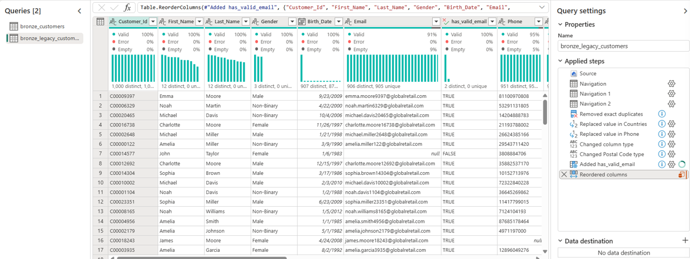
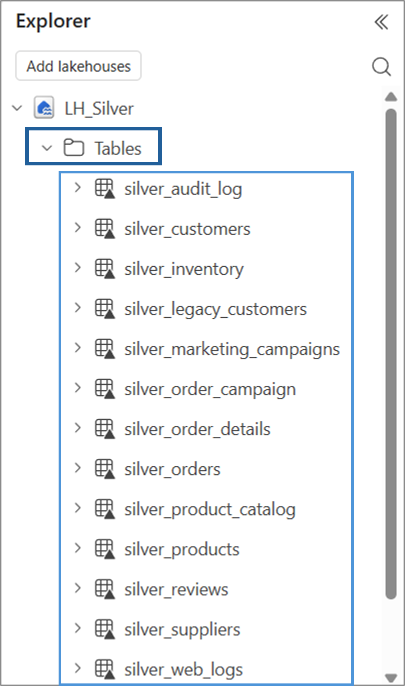

# Silver Layer

> The Silver layer transforms raw Bronze data into clean, deduplicated, standardized and quality-checked datasets. This is where semi-structured data gets parsed, business-irrelevant noise gets removed and every table becomes reliable to be consumed by the Gold layer modeling logic.

---

# Fabric Objects & Structure


| Object | Type | Purpose |
|---|---|---|
| LH_Silver | Lakehouse | Stores cleaned data as Delta tables |
| NB_Silver_Analyze_Load_ERP_Tables | Notebook | Cleans and loads ERP tables (suppliers, inventory, products) |
| NB_Silver_Analyze_Load_sales_tables | Notebook | Cleans and loads SQL Server-sourced tables (orders, order_details, reviews, order_campaign) |
| NB_Silver_Clean_Load_product_catalog | Notebook | Flattens nested JSON structures (attributes, images) |
| Dataflow_crm_from_bronze_to_silver | Dataflow Gen2 | Cleans CRM tables (customers, legacy_customers) |
| Silver_Pipeline | Pipeline | Orchestrates all Silver transformations across sources |


```text
GlobalRetail
│
└── Silver Layer
     │
     ├── LH_Silver
     │    ├── Tables/
     │    └── SQL Analytics Endpoint
     │
     ├── NB_Silver_Analyze_Load_ERP_Tables 
     │    
     ├── NB_Silver_Analyze_Load_sales_tables
     │
     ├── NB_Silver_Clean_Load_product_catalog
     │
     ├── Dataflow_crm_from_bronze_to_silver     
     │
     └── Silver_Pipeline
```

---

# Architecture


---


# Pipeline: Silver_Pipeline
This pipeline promotes the ingested data from the Bronze layer to the Silver layer, it is designed for scalability and governance rather than one-off processing. 
On one side we have a branch that reads the same configuration file used in the Bronze layer to isolate and manage some specific tables, while on the other side
there are some independent objects used to apply more sophisticated transformations through notebooks and dataflows.

In practice it's a configuration-driven orchestrator that dispatches the "silvering" work depending on the folder/domain each table belongs to using different tool to transform and clean data.

For the complete JSON code: [Silver_Pipeline](../../fabric_workspace/02.%20silver_layer/Silver_Pipeline.json)


    Lookup (read config_ingestion.csv)
    |
    +-- Filter (marketing, ecommerce) --> ForEach --> Copy Activity (direct promotion, no cleaning)
    |
    +-- Filter (product_catalog)      --> Notebook (flatten nested JSON)
    |
    +-- Notebook                      --> ERP tables (suppliers, inventory, products) 
    |
    +-- Notebook                      --> Sales tables (orders, order_details, reviews, order_campaign)
    |
    +-- Dataflow Gen2                 --> CRM tables (customers, legacy_customers)


## Branch 1 - Marketing & Ecommerce
This branch is responsible for promoting the Marketing and E-commerce tables `bronze_marketing_campaigns` and `bronze_web_logs`.

Unlike the other approaches, these tables do not require additional transformations at this stage. The data is therefore transferred directly from the Bronze Lakehouse tables to the corresponding Silver Lakehouse tables using a parameterized Copy Activity.

The process is driven by the centralized config_ingestion.csv configuration file, making the ingestion logic dynamic and avoiding hard-coded table names within the pipeline. In fact for the source, the filter activity evaluates the `SourceFolder` column using the following expression: 

`@contains(createArray('marketing','ecommerce'), item().SourceFolder)`

For the destination the target table name is generated dynamically by replacing the 'bronze_' prefix with 'silver_': 

`@replace(item().DestinationTable, 'bronze_', 'silver_')`

---

## Branch 2 - Product Catalog
The same filter activity as for the previous branch is applied to get the desired table.

In order to promote `bronze_product_catalog`, it is not possible to follow a standard copy activity approach, because two of its columns are nested andsemi-structured:

* `attributes`: a struct containing `color`, `warranty_months` and `weight_kg`.
* `images`: an array of URL strings, with a variable number of elements per product.

Neither Power BI nor a standard relational Gold model can meaningfully consume nested or array-typed columns, they need to become ordinary columns and rows. A plain Copy data activity cannot flatten these structures or trim/clean the values inside them. A dedicated notebook [NB_Silver_Clean_&_load_product_catalog](../../fabric_workspace/02.%20silver_layer/NB_Silver_Clean_&_load_product_catalog.ipynb) handles this in two conceptual steps:


1. **Recursive cleaning**: a trim/empty-to-NULL logic is applied recursively, reaching inside the nested `attributes` structure and inside every element of the `images` list; a plain top-level cleaning pass would not touch anything nested.
2. **Flattening**: the nested `attributes` structure is expanded into ordinary top-level columns, and the `images` list is exploded so that each URL becomes its own row, tagged with a position index (so the first image can still be distinguished from secondary ones).

One important consequence of this design: because exploding the image list turns one product row into multiple rows (one per image), the resulting `silver_product_catalog` table legitimately has more rows than its Bronze counterpart. This is expected behavior, not a data quality problem.
 
 ---


## ERP Tables (Notebook)

To process all ERP Bronze tables (suppliers, inventory, products) an isolated notebook it used and it follows a consistent flow: read the same configuration file used in Bronze, filter down to only the ERP rows, profile data quality before touching anything, apply lightweight structural cleaning, write the result to Silver, and log the outcome.

The full notebook is available here: [NB_Silver_Analyze_Load_erp_tables.ipynb](../../fabric_workspace/02.%20silver_layer/NB_Silver_Analyze_Load_erp_tables.ipynb)

1. Read and filter configuration file:
```spark
rows = (
    df_config
    .filter(df_config.SourceFolder == SOURCE_FOLDER)
    .collect()
)
```

2. Apply a function to get quality data information:

     - the total row count
     - the number of duplicate rows (comparing total rows against distinct rows)
     - the number of "ghost rows" (rows where every single column is NULL)
     - the NULL percentage for every individual column, flagging anything above a 10% threshold as worth reviewing
3. Apply a recursive function to clean data:
     - trim leading/trailing spaces from text columns
     - normalize empty strings to proper NULLs
     - drop fully-empty "ghost rows"
     - add two audit columns (processing timestamp and the source folder) to support lineage tracing

4. Write cleaned data to silver layer returning the following output:
```spark
    Processing: bronze_suppliers -> silver_suppliers
      Completed | Bronze rows: 500 | Silver rows: 500 | Discarded: 0

    Processing: bronze_inventory -> silver_inventory
      Completed | Bronze rows: 10,000 | Silver rows: 10,000 | Discarded: 0

    Processing: bronze_products -> silver_products
      Completed | Bronze rows: 10,000 | Silver rows: 10,000 | Discarded: 0

    Tables OK: 3/3 | Tables Failed: 0/3
```

5. Save result in an audit log file: Every execution of this notebook writes its results (row counts, duration, success/failure status) into a shared `silver_audit_log` Delta table, in append mode. This means the audit log accumulates history across runs giving a full execution history over time. If any table fails during processing, the notebook still attempts all remaining tables before raising an explicit error at the end, so a single failure does not silently block the rest of the batch.

---
## Sales Tables (Notebook)

This notebook processes all SQL Server-sourced Bronze tables (orders, order details, reviews, order campaign attribution). 

It follows the same overall pattern as the ERP notebook: configuration-driven table selection, cleaning, full overwrite to Silver and shared audit logging, but with a simpler cleaning approach, since this data originates from a relational OLTP database that already enforces its own constraints at the source and therefore requires less aggressive structural cleanup.

Unlike the ERP notebook, no separate pre-cleaning quality report is produced here, because the assumption is that OLTP-sourced data is inherently more structured than exported flat files, so the emphasis shifts from "diagnose how dirty is this data" to "apply a quick consistency pass and move on".

The full notebook is available here: [NB_Silver_Analyze_Load_sales_tables](../../fabric_workspace/02.%20silver_layer/NB_Silver_Analyze_Load_sales_tables.ipynb)


This notebook writes to the same shared `silver_audit_log` table used by the ERP notebook, so both contribute to a single, unified execution history.

---

## CRM Tables (Dataflow Gen2)

Unlike ERP and SQL Server tables, CRM data is processed using a **Dataflow Gen2** rather than a PySpark notebook. This choice reflects the nature of the data: only two tables, moderate volume, and transformations that map naturally to Power Query's low-code visual editor rather than justifying a full Spark job.

The Dataflow (`Dataflow_crm_from_bronze_to_silver`) connects directly to `LH_Bronze` as its source and writes into `LH_Silver` as its destination.

`bronze_customers`: this table arrives already reasonably clean from Bronze, so no transformation is applied and it is loaded into Silver as-is.

`bronze_legacy_customers`: this table intentionally simulates a "dirty" legacy system export with inconsistent formatting, and receives more involved cleaning:

- **Deduplication**: exact full-row duplicates are removed
- **Country standardization**: inconsistent country naming (e.g. "USA" vs "United States") is normalized to a single consistent value
- **Placeholder normalization**: literal placeholder values such as "UNKNOWN" in the phone field are converted to proper NULLs, to not cause errors during later type conversions
- **Locale-aware date parsing**: date columns are parsed using an explicit locale, to avoid ambiguous day/month misinterpretation that can happen with mixed date formats
- **Safe type casting**: postal codes are cast to text rather than numeric, to avoid losing meaningful leading zeros
- **Data quality flagging**: a new boolean column flags whether each record has a valid (non-null) email, useful later for filtering or reporting on data completeness
- **Column reordering** purely for readability and consistency of the output table



The full M code is available here: [Dataflow_crm_from_bronze_to_silver](../../fabric_workspace/02.%20silver_layer/Dataflow_crm_from_bronze_to_silver.pq)

Both queries are configured with a destination pointing to `LH_Silver`, producing `silver_customers` and `silver_legacy_customers`

---


## Resulting Silver Tables & Folder Structure in LH_Silver



| Table | Source Engine |
|---|---|
| silver_customers | CRM (Dataflow Gen2) |
| silver_legacy_customers | CRM (Dataflow Gen2) |
| silver_suppliers | ERP (Notebook) |
| silver_inventory | ERP (Notebook) |
| silver_products | ERP (Notebook) |
| silver_product_catalog | GitHub (Notebook, flattened) |
| silver_marketing_campaigns | GitHub (Copy Activity) |
| silver_web_logs | GitHub (Copy Activity) |
| silver_orders | SQL Server (Notebook) |
| silver_order_details | SQL Server (Notebook) |
| silver_reviews | SQL Server (Notebook) |
| silver_order_campaign | SQL Server (Notebook) |
| silver_audit_log | Shared audit table (ERP + sales notebooks) |
