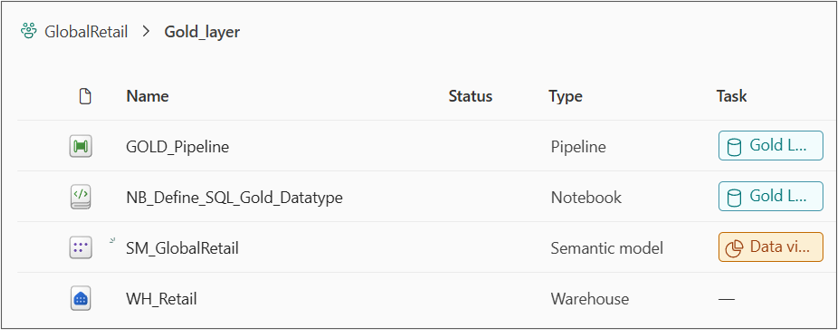
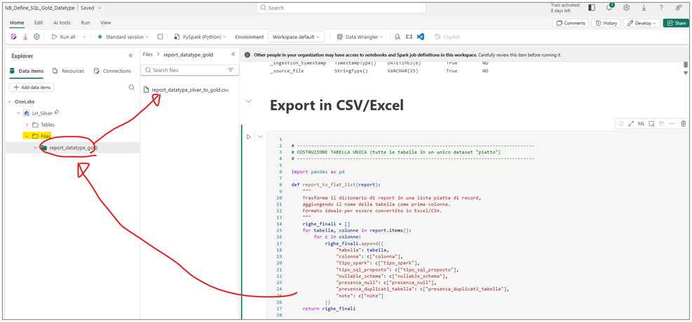
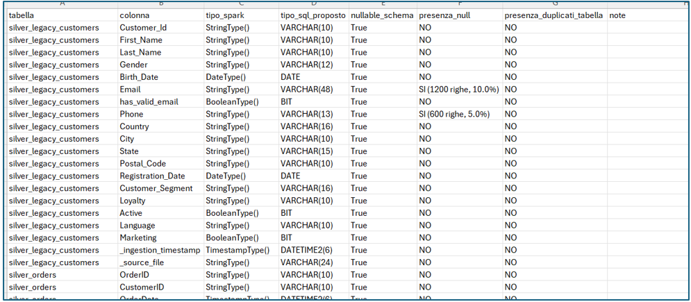

# Gold Layer

> The Gold layer is the business-ready data warehouse layer, where trusted Silver data is transformed into a dimensional model optimized for analytics and reporting. Business logic, KPIs and relationships are consolidated into fact and dimension tables, providing a consistent and governed data foundation for the semantic model and Power BI reporting through Direct Lake.

---

# Table of Contents

---

# Fabric Objects & Structure


| Object | Type | Purpose |
|---|---|---|
| WH_Retail | Data Warehouse | Hosts the star schema (dimensions + facts) |
| NB_Define_SQL_Gold_Datatype | Notebook | Profiles Silver data to propose optimal SQL data types for Gold DDL |
| GOLD_Pipeline | Pipeline | Orchestrates all stored procedures (dimensions first, then facts) |
| SM_GlobalRetail | Semantic Model (Direct Lake) | Exposes WH_Retail directly to Power BI |

```text
GlobalRetail
│
└── Gold Layer
     │
     ├── WH_Retail
     │
     ├── NB_Define_SQL_Gold_Datatype
     │    
     ├── GOLD_Pipeline
     │
     └──SM_GlobalRetail
```

# Architecture

# Determining SQL Data Types: NB_Define_SQL_Gold_Datatype

Before writing a single line of DDL, a dedicated notebook analyzes every Silver table and proposes an appropriate SQL data type for each column, rather than guessing or defaulting everything to oversized generic types.

The full notebook is available here: [NB_Define_SQL_Gold_Datatype](../../fabric_workspace/02.%20gold_layer/NB_Define_SQL_Gold_Datatype.ipynb)

For every column of every Silver table, the notebook inspects the Spark data type and decides the most sensible SQL equivalent based on what is actually observed in the data:

- **Text columns** are sized based on the real maximum length found in the data, with a safety margin added on top, rather than being arbitrarily capped. Only if the real content exceeds a reasonable threshold does it fall back to an unbounded text type.
- **Decimal/float columns** are analyzed to determine the actual precision and scale needed, based on the largest value present, which avoids the typical rounding issues that come from blindly using floating-point types for numbers that represent money or quantities.
- **Whole numbers, dates, timestamps, booleans, and binary data** map in a fairly direct and predictable way to their SQL equivalents.
- Any column whose type cannot be confidently mapped falls back to a safe generic text type, but is explicitly flagged with a warning, so it gets a manual review rather than silently becoming a wrong assumption baked into the DDL.

### Data Quality Checks, Reused for Design Decisions

Alongside type mapping, the same notebook also answers two more questions per table, which directly influence the DDL:

- **Does this column actually contain NULLs?** If a column is technically nullable in Silver but never actually contains a NULL value, this is a signal that it could safely become `NOT NULL` in Gold, tightening the model's constraints.
- **Does this table contain duplicate rows?** Comparing total row count against distinct row count flags whether deduplication needs to happen before or during the Gold load, rather than assuming Silver is already perfectly deduplicated.

### Output

For every Silver table, the notebook prints a structured comparison: original Spark type, proposed SQL type, whether NULLs are actually present (and how many), whether duplicates exist at the table level, and any warning notes that deserve a manual look before finalizing the DDL. This full report is also exported to a file in the Silver Lakehouse, so the type decisions can be reviewed offline before the Gold tables are actually created.

 <div align="center">
  
  
</div>

# Data Warehouse Structure
The DWH has organized grouping the tables into 4 schemas, each one representing a business domain instead of a source system:
| Schema | Contains |
|---|---|
| _Shared_Dim | dim_customers, dim_products, dim_date |
| _Transactions | fact_orders, fact_orders_details |
| _Supply_Chain | fact_inventory, dim_suppliers |
| _Marketing | dim_campaign, fact_order_campaign, fact_web_logs, fact_reviews |
