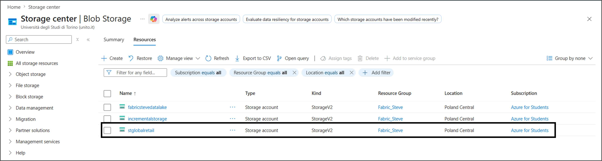
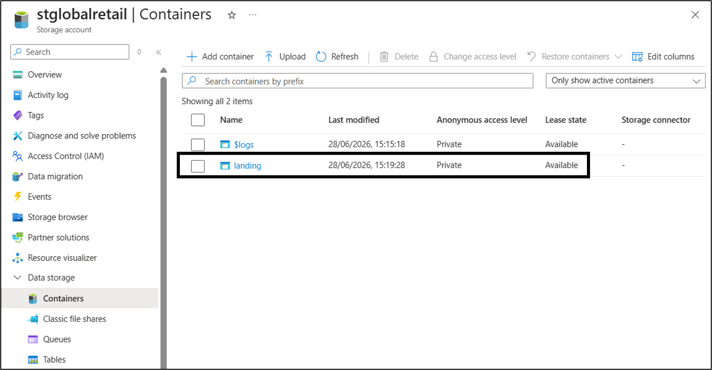
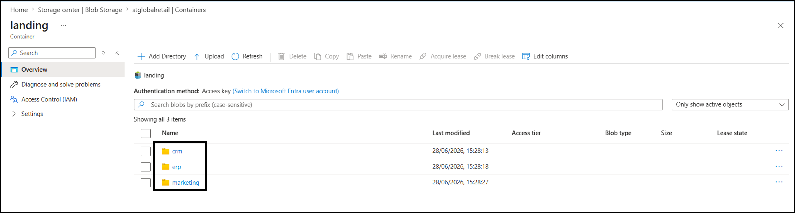

# Data Source: Azure Data Lake Storage Gen2

## Overview

Azure Data Lake Storage Gen2 (ADLS2) acts as the **Landing Zone** for all batch file exports coming from the CRM and ERP source systems. It sits between the source systems and Microsoft Fabric, decoupling ingestion from the applications that originally produce the data.

| Element | Value |
|---|---|
| Storage account | `stglobalretail` |
| Container | `landing` |
| Paths | `landing/crm/`, `landing/erp/`, `landing/marketing/` |





## Why ADLS Gen2 as a Landing Zone?

Using a Landing Zone is not a Fabric-specific requirement, but an architectural choice:

- **Decouples ingestion from source availability** isolates the analytics platform from source schedules, maintenance, and downtime.
- **Preserves an original copy** of the raw data, independent of any transformation
- **Facilitates reuse** by other downstream systems, not just Fabric

In short: ADLS Gen2 is not "just a folder", but the contractual boundary between source systems and the analytics platform.

## Data Hosted
 Data is uploaded manually for this project (via Azure Portal upload), simulating what would normally be an automated export job from CRM/ERP systems in a real environment.
| Domain | File | Description |
|---|---|---|
| CRM | `customers.csv` | Active customer master data |
| CRM | `legacy_customers.csv` | Legacy/historical customer records (intentionally "dirty" — see [Silver Layer](../silver_layer.md) for cleaning logic) |
| ERP | `products.csv` | Product master data |
| ERP | `suppliers.csv` | Supplier master data |
| ERP | `inventory.csv` | Warehouse inventory levels |

## Storage Structure
```text
stglobalretail
│
└── landing
    │
    ├── crm
    │   ├── customers.csv
    │   └── legacy_customers.csv
    │
    ├── erp
    │   ├── inventory.csv
    │   ├── suppliers.csv
    │   │
    │   └── Shortcut
    │       └── products.csv
    │
    └── marketing
```
