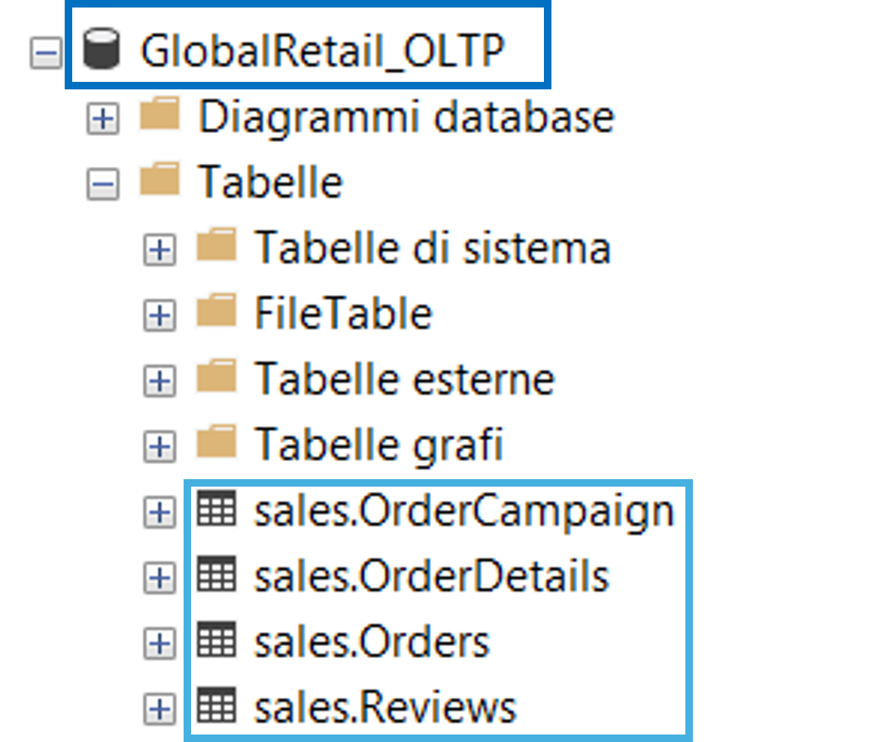

# Data Source: SQL Server (OLTP)

## Overview

SQL Server hosts the **operational, transactional database** of the simulated e-commerce application. This source represents a live **OLTP system**, so the kind of database an application would read/write in real time.

> **Important distinction**: this is not a Data Warehouse. It is modeled as an OLTP system, with normalized tables, constraints, and indexes typical of a transactional database.

## Data Hosted

All transactional/order-related data lives in a SQL Server database, under a dedicated `sales` schema:



| Table | Description |
|---|---|
| `Orders` | Order header data (customer, date, status, payment, totals) |
| `OrderDetails` | Order line items (product, quantity, price, discount) |
| `OrderCampaign` | Attribution data linking orders to marketing campaigns |
| `Reviews` | Product reviews left by customers |

> Reviews are intentionally included here rather than treated as a separate system: many real-world e-commerce platforms store customer reviews directly in the application's operational database, not in a separate service.

## Database

- **Name**: `GlobalRetail_OLTP`
- **Schema**: `sales`

```text
GlobalRetail_OLTP
|
└── sales
    ├── Orders
    ├── OrderDetails
    ├── Reviews
    └── OrderCampaign
```

## Scripts
The following folders contains all the script to build the database: [SQL Server scripts](https://github.com/StefanoN98/Microsoft-Fabric-Project/tree/11b8fb65046725ab765296659db062dcaaa77709/docs/Data%20Sources/SQL%20SERVER/scripts)

In particular:
- [Script 1](https://github.com/StefanoN98/Microsoft-Fabric-Project/blob/11b8fb65046725ab765296659db062dcaaa77709/docs/Data%20Sources/SQL%20SERVER/scripts/01_script_create_tables_SSMS.sql) creates the database tables and their schemas. Existing tables are dropped before creation to ensure a clean and reproducible setup. Data types are selected according to the expected data, with NOT NULL constraints applied to mandatory fields and primary keys defined for entity identification.

- [Script 2](https://github.com/StefanoN98/Microsoft-Fabric-Project/blob/11b8fb65046725ab765296659db062dcaaa77709/docs/Data%20Sources/SQL%20SERVER/scripts/02_script_insert_bulk.sql) loads the source data into the database. BULK INSERT is used for CSV files, while OPENROWSET combined with OPENJSON is used to parse and load JSON data.

- [Script 3](https://github.com/StefanoN98/Microsoft-Fabric-Project/blob/11b8fb65046725ab765296659db062dcaaa77709/docs/Data%20Sources/SQL%20SERVER/scripts/03_set_index_tables.sql) creates non-clustered indexes on columns frequently used for joins, filtering, searching, and analytical queries, such as customer IDs, product IDs, order dates, and campaign IDs. The indexes are designed to improve query performance on the most commonly accessed attributes.

- [Script 4](https://github.com/StefanoN98/Microsoft-Fabric-Project/blob/11b8fb65046725ab765296659db062dcaaa77709/docs/Data%20Sources/SQL%20SERVER/scripts/04_script_constraints_%26_business_rules_tables.sql) applies referential integrity constraints and business rules. Foreign keys are defined between related tables, while CHECK constraints enforce data quality rules such as valid ratings, positive quantities, non-negative prices and order totals, and supported currency values.

 ## Connecting SQL Server to Fabric
 Since SQL Server runs on-premises (or in this project's case, on a local machine) and Fabric is cloud-based, an On-premises Data Gateway is required to bridge the two environments.

So to guarantee the connection:

1. Install the On-premises Data Gateway (Standard mode) on the machine hosting SQL Server
2. Register the gateway under the Fabric-linked account
3. Create a new connection in Fabric of type SQL Server, using Basic Authentication and pointing to the gateway cluster
4. Reference this connection inside the ingestion pipeline's Copy Activity / Lookup Activity

See Gateway Setup (metti link) for the full walkthrough.
